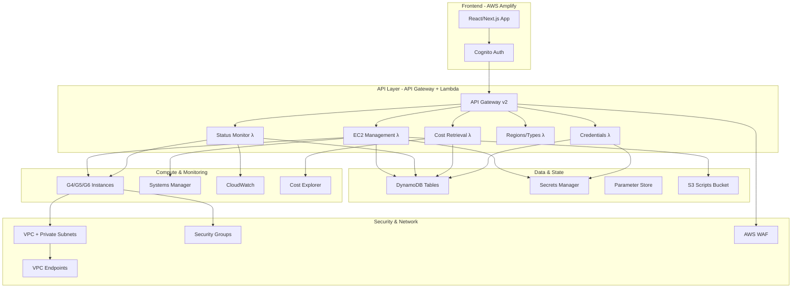

# Media Workstation Automation System - Architecture Plan

## Executive Summary

A serverless AWS application for managing virtual editing workstations with React/Next.js frontend, supporting both domain-joined and standalone Windows Server instances with comprehensive monitoring and cost tracking.

## System Architecture



## Authentication & Authorization Model

### User Roles & Permissions

**Admin Role (`workstation-admin`):**
- Full CRUD access to all workstations across all users
- Access to comprehensive cost analytics and reporting
- User management and system configuration
- Bulk operations and policy enforcement

**User Role (`workstation-user`):**
- CRUD access only to their own workstations
- Read-only access to their cost data
- Cannot modify system settings or access other users' resources

### Cognito Configuration

```typescript
// User Pool Configuration
{
  userPoolName: "media-workstation-users",
  mfaConfig: "REQUIRED",
  passwordPolicy: {
    minimumLength: 12,
    requireUppercase: true,
    requireLowercase: true,
    requireNumbers: true,
    requireSymbols: true
  },
  customAttributes: {
    role: "admin|user",
    department: "string",
    costCenter: "string"
  }
}
```

## Data Schema Design

### DynamoDB Tables

**1. Workstations Table (`workstation-management`)**
```typescript
{
  // Partition Key: Workstation ID
  PK: "WORKSTATION#ws-abc123",
  SK: "METADATA",
  
  // Core Instance Data
  instanceId: "i-0abc123def456",
  userId: "user@company.com", 
  userRole: "user|admin",
  
  // Configuration
  region: "us-west-2",
  availabilityZone: "us-west-2a",
  instanceType: "g4dn.xlarge",
  osVersion: "Windows Server 2019",
  amiId: "ami-12345678",
  
  // Network & Access
  vpcId: "vpc-12345",
  subnetId: "subnet-12345",
  securityGroupId: "sg-12345",
  publicIp: "54.123.45.67",
  privateIp: "10.0.1.100",
  
  // Authentication Method
  authMethod: "domain|local", 
  domainJoined: true,
  domainName: "corp.example.com",
  localAdminUser: "WorkstationAdmin",
  credentialsSecretArn: "arn:aws:secretsmanager:...",
  
  // Status & Lifecycle  
  status: "launching|running|stopping|stopped|terminated",
  launchTime: "2024-01-15T10:30:00Z",
  lastStatusCheck: "2024-01-15T11:00:00Z",
  autoTerminateAt: "2024-01-16T18:00:00Z",
  
  // Cost Tracking
  estimatedHourlyCost: 0.526,
  estimatedMonthlyCost: 378.72,
  actualCostToDate: 12.63,
  
  // Metadata
  tags: {
    Project: "VFX-Project-Alpha",
    Department: "Post-Production",
    Owner: "user@company.com"
  },
  createdAt: "2024-01-15T10:30:00Z",
  updatedAt: "2024-01-15T11:00:00Z"
}
```

**2. Cost Tracking Table (`cost-analytics`)**
```typescript
{
  // Daily cost aggregation
  PK: "COST#2024-01-15",
  SK: "USER#user@company.com",
  
  totalDailyCost: 12.63,
  instanceCosts: {
    "i-0abc123def456": {
      cost: 12.63,
      hours: 24,
      instanceType: "g4dn.xlarge"
    }
  },
  
  // Monthly aggregation
  PK: "COST#2024-01",
  SK: "MONTHLY#user@company.com",
  totalMonthlyCost: 378.72,
  // ... similar structure
}
```

**3. User Sessions Table (`user-sessions`)**
```typescript
{
  PK: "SESSION#user@company.com",
  SK: "ACTIVE",
  
  activeWorkstations: ["ws-abc123", "ws-def456"],
  totalRunningCost: 1.052, // per hour
  monthlySpend: 234.56,
  lastActivity: "2024-01-15T11:00:00Z",
  preferences: {
    defaultRegion: "us-west-2",
    defaultInstanceType: "g4dn.xlarge"
  }
}
```

## API Specification

### Core Endpoints

**Workstation Management**

```typescript
// Launch new workstation
POST /api/workstations
Authorization: Bearer {cognito-token}
Body: {
  region: "us-west-2",
  instanceType: "g4dn.xlarge", 
  osVersion: "Windows Server 2019",
  authMethod: "domain|local",
  domainConfig?: {
    domainName: "corp.example.com",
    ouPath: "OU=Workstations,DC=corp,DC=example,DC=com"
  },
  localAdminConfig?: {
    username: "WorkstationAdmin"
  },
  autoTerminateHours?: 24,
  tags?: { Project: "...", Department: "..." }
}
Response: {
  workstationId: "ws-abc123",
  instanceId: "i-0abc123def456",
  status: "launching",
  estimatedReadyTime: "2024-01-15T10:45:00Z"
}

// List workstations
GET /api/workstations?userId={id}&status={status}
Response: {
  workstations: [...],
  totalRunningCost: 2.104, // per hour
  totalInstances: 3
}

// Get workstation details
GET /api/workstations/{workstationId}
Response: {
  ...workstation-details,
  connectionInfo: {
    publicIp: "54.123.45.67",
    rdpPort: 3389,
    credentials?: {
      type: "domain|local",
      domain?: "corp.example.com", 
      username: "user@corp.example.com|WorkstationAdmin",
      password: "****** (from Secrets Manager)"
    }
  }
}

// Terminate workstation
DELETE /api/workstations/{workstationId}
Response: { status: "terminating" }
```

**Status & Monitoring**

```typescript
// Real-time status dashboard
GET /api/dashboard/status
Response: {
  summary: {
    totalInstances: 15,
    runningInstances: 12,
    stoppedInstances: 2,
    terminatingInstances: 1,
    totalHourlyCost: 15.78,
    estimatedMonthlyCost: 11364.0
  },
  instances: [
    {
      workstationId: "ws-abc123",
      instanceId: "i-0abc123def456", 
      userId: "user@company.com",
      status: "running",
      publicIp: "54.123.45.67",
      instanceType: "g4dn.xlarge",
      region: "us-west-2",
      runTime: "4h 32m",
      hourlyCost: 0.526
    }
  ]
}

// Health check endpoint
GET /api/health
Response: {
  status: "healthy",
  version: "1.0.0",
  timestamp: "2024-01-15T11:00:00Z",
  services: {
    dynamodb: "healthy",
    ec2: "healthy",
    costExplorer: "healthy"
  }
}
```

**Cost Analytics**

```typescript
// Cost dashboard data  
GET /api/costs?period={daily|weekly|monthly}&userId={id}
Response: {
  period: "monthly",
  totalCost: 1234.56,
  breakdown: {
    byInstanceType: {
      "g4dn.xlarge": 678.90,
      "g5.2xlarge": 555.66
    },
    byUser: {
      "user1@company.com": 400.00,
      "user2@company.com": 834.56
    },
    byRegion: {
      "us-west-2": 800.00,
      "us-east-1": 434.56
    }
  },
  trends: {
    dailyAverage: 41.15,
    projectedMonthly: 1234.50
  }
}
```

**Configuration**

```typescript
// Available regions
GET /api/regions  
Response: {
  regions: [
    {
      id: "us-west-2",
      name: "US West (Oregon)",
      available: true,
      instanceTypes: ["g4dn.xlarge", "g4dn.2xlarge", "g5.xlarge"]
    }
  ]
}

// Available instance types
GET /api/instance-types
Response: {
  instanceTypes: [
    {
      type: "g4dn.xlarge",
      vcpus: 4,
      memory: "16 GiB", 
      gpu: "1x NVIDIA T4",
      storage: "225 GB NVMe SSD",
      network: "Up to 25 Gbps",
      hourlyCost: 0.526,
      monthlyCost: 378.72
    }
  ]
}
```

## Lambda Function Architecture

### 1. EC2 Management Function
```typescript
// Handler: ec2-management.ts
export const handler = async (event: APIGatewayProxyEvent) => {
  const { httpMethod, pathParameters, body } = event;
  
  switch (httpMethod) {
    case 'POST':
      return await launchWorkstation(JSON.parse(body));
    case 'GET':
      return await getWorkstation(pathParameters.workstationId);
    case 'DELETE':
      return await terminateWorkstation(pathParameters.workstationId);
  }
};

const launchWorkstation = async (config: LaunchConfig) => {
  // 1. Validate user permissions
  // 2. Get latest Windows Server AMI
  // 3. Generate User Data script
  // 4. Launch EC2 instance
  // 5. Create DynamoDB record
  // 6. Setup auto-termination (EventBridge)
  // 7. Return workstation details
};
```

### 2. Status Monitoring Function
```typescript
// Handler: status-monitor.ts  
export const handler = async (event: APIGatewayProxyEvent) => {
  // 1. Get all active workstations from DynamoDB
  // 2. Query EC2 for current instance status
  // 3. Update DynamoDB with latest status
  // 4. Calculate real-time costs
  // 5. Return dashboard data
};
```

### 3. Cost Analytics Function
```typescript
// Handler: cost-analytics.ts
export const handler = async (event: APIGatewayProxyEvent) => {
  // 1. Query Cost Explorer API
  // 2. Aggregate cost data by user/region/instance type
  // 3. Calculate trends and projections  
  // 4. Cache results in DynamoDB
  // 5. Return formatted cost data
};
```

## Security Implementation

### Network Security
```typescript
// VPC Configuration
const vpc = new ec2.Vpc(this, 'WorkstationVPC', {
  cidr: '10.0.0.0/16',
  maxAzs: 3,
  natGateways: 1,
  subnetConfiguration: [
    {
      cidrMask: 24,
      name: 'Public',
      subnetType: ec2.SubnetType.PUBLIC
    },
    {
      cidrMask: 24, 
      name: 'Private',
      subnetType: ec2.SubnetType.PRIVATE_WITH_NAT
    }
  ]
});

// Security Group - Workstation Access
const workstationSG = new ec2.SecurityGroup(this, 'WorkstationSG', {
  vpc,
  description: 'Security group for media workstations',
  allowAllOutbound: true
});

workstationSG.addIngressRule(
  ec2.Peer.ipv4('10.0.0.0/8'), // Corporate networks only
  ec2.Port.tcp(3389),
  'RDP access from corporate networks'
);
```

### IAM Roles & Policies
```typescript
// Lambda Execution Role
const ec2ManagementRole = new iam.Role(this, 'EC2ManagementRole', {
  assumedBy: new iam.ServicePrincipal('lambda.amazonaws.com'),
  managedPolicies: [
    iam.ManagedPolicy.fromAwsManagedPolicyName('service-role/AWSLambdaVPCAccessExecutionRole')
  ],
  inlinePolicies: {
    EC2Management: new iam.PolicyDocument({
      statements: [
        new iam.PolicyStatement({
          effect: iam.Effect.ALLOW,
          actions: [
            'ec2:RunInstances',
            'ec2:TerminateInstances', 
            'ec2:DescribeInstances',
            'ec2:DescribeImages',
            'ec2:CreateTags'
          ],
          resources: ['*'],
          conditions: {
            StringEquals: {
              'ec2:InstanceType': ['g4dn.xlarge', 'g4dn.2xlarge', 'g5.xlarge', 'g5.2xlarge', 'g6.xlarge']
            }
          }
        })
      ]
    })
  }
});
```

## Frontend Implementation (React/Next.js)

### Component Structure
```
src/
├── components/
│   ├── auth/
│   │   ├── LoginForm.tsx
│   │   └── ProtectedRoute.tsx
│   ├── dashboard/
│   │   ├── StatusDashboard.tsx
│   │   ├── CostDashboard.tsx
│   │   └── WorkstationCard.tsx
│   ├── workstation/
│   │   ├── LaunchWorkstationForm.tsx
│   │   ├── WorkstationDetails.tsx
│   │   └── ConnectionInfo.tsx
│   └── common/
│       ├── Layout.tsx
│       ├── Navigation.tsx
│       └── LoadingSpinner.tsx
├── pages/
│   ├── index.tsx (Dashboard)
│   ├── workstations/
│   │   ├── new.tsx
│   │   └── [id].tsx
│   ├── costs.tsx
│   └── admin/
│       ├── users.tsx
│       └── system.tsx
├── hooks/
│   ├── useAuth.ts
│   ├── useWorkstations.ts
│   └── useCosts.ts
├── services/
│   ├── api.ts
│   ├── auth.ts
│   └── websocket.ts
└── types/
    ├── workstation.ts
    ├── user.ts
    └── api.ts
```

### Key Components

**Launch Workstation Form**
```typescript
const LaunchWorkstationForm = () => {
  const [config, setConfig] = useState({
    region: 'us-west-2',
    instanceType: 'g4dn.xlarge',
    osVersion: 'Windows Server 2019',
    authMethod: 'local', // or 'domain'
    autoTerminateHours: 24
  });

  const handleSubmit = async () => {
    const response = await api.post('/workstations', config);
    // Handle success/error
  };

  return (
    <form onSubmit={handleSubmit}>
      <RegionSelector value={config.region} onChange={...} />
      <InstanceTypeSelector value={config.instanceType} onChange={...} />
      <AuthMethodSelector value={config.authMethod} onChange={...} />
      {config.authMethod === 'domain' && <DomainConfiguration />}
      <AutoTerminateSelector value={config.autoTerminateHours} onChange={...} />
      <button type="submit">Launch Workstation</button>
    </form>
  );
};
```

## Deployment Strategy

### Infrastructure as Code (CDK)
```typescript
// lib/workstation-stack.ts
export class WorkstationStack extends Stack {
  constructor(scope: Construct, id: string, props?: StackProps) {
    super(scope, id, props);

    // 1. VPC & Networking
    const vpc = this.createVPC();
    
    // 2. DynamoDB Tables  
    const tables = this.createDynamoTables();
    
    // 3. Cognito User Pool
    const userPool = this.createCognitoUserPool();
    
    // 4. Lambda Functions
    const functions = this.createLambdaFunctions(vpc, tables);
    
    // 5. API Gateway
    const api = this.createApiGateway(functions, userPool);
    
    // 6. Amplify App
    const amplifyApp = this.createAmplifyApp(api, userPool);
    
    // 7. Monitoring & Alarms
    this.createMonitoring(functions, tables);
  }
}
```

### Deployment Pipeline
```yaml
# .github/workflows/deploy.yml
name: Deploy Workstation Management System

on:
  push:
    branches: [main]
  pull_request:
    branches: [main]

jobs:
  test:
    runs-on: ubuntu-latest
    steps:
      - uses: actions/checkout@v3
      - uses: actions/setup-node@v3
      - run: npm ci
      - run: npm run test
      - run: npm run test:e2e

  security-scan:
    runs-on: ubuntu-latest  
    steps:
      - uses: actions/checkout@v3
      - name: Run Snyk Security Scan
        uses: snyk/actions/node@master
        env:
          SNYK_TOKEN: ${{ secrets.SNYK_TOKEN }}

  deploy:
    needs: [test, security-scan]
    if: github.ref == 'refs/heads/main'
    runs-on: ubuntu-latest
    steps:
      - uses: actions/checkout@v3
      - name: Configure AWS credentials
        uses: aws-actions/configure-aws-credentials@v2
      - name: Deploy Infrastructure
        run: |
          npm ci
          npm run cdk deploy -- --all --require-approval never
      - name: Deploy Frontend
        run: |
          cd frontend
          npm ci
          npm run build
          aws s3 sync build/ s3://${{ env.AMPLIFY_BUCKET }}
```

## Monitoring & Alerting

### CloudWatch Dashboards
```typescript
// Operational Dashboard
const dashboard = new cloudwatch.Dashboard(this, 'WorkstationDashboard', {
  widgets: [
    [
      new cloudwatch.GraphWidget({
        title: 'Active Instances',
        left: [instanceCountMetric]
      }),
      new cloudwatch.GraphWidget({
        title: 'Hourly Costs', 
        left: [costMetric]
      })
    ],
    [
      new cloudwatch.LogWidget({
        title: 'Recent Launch Failures',
        logGroup: lambdaLogGroup,
        queryLines: [
          'fields @timestamp, @message',
          'filter @message like /ERROR/',
          'sort @timestamp desc',
          'limit 20'
        ]
      })
    ]
  ]
});
```

### Cost Alerts
```typescript
// Budget Alerts
const monthlyBudget = new budgets.CfnBudget(this, 'MonthlyBudget', {
  budget: {
    budgetName: 'WorkstationMonthlyBudget',
    budgetLimit: {
      amount: 5000,
      unit: 'USD'
    },
    timeUnit: 'MONTHLY',
    budgetType: 'COST'
  },
  notificationsWithSubscribers: [{
    notification: {
      notificationType: 'ACTUAL',
      comparisonOperator: 'GREATER_THAN',
      threshold: 80
    },
    subscribers: [{
      subscriptionType: 'EMAIL',
      address: 'admin@company.com'
    }]
  }]
});
```

## Implementation Timeline

**Phase 1: Foundation (Weeks 1-2)**
- Core infrastructure (VPC, DynamoDB, Cognito)
- Basic Lambda functions (launch, terminate, list)
- API Gateway with authentication
- Basic React frontend with authentication

**Phase 2: Core Features (Weeks 3-4)**  
- EC2 management with Windows AMI selection
- Status monitoring and real-time updates
- Basic cost tracking
- User interface for workstation management

**Phase 3: Advanced Features (Weeks 5-6)**
- Domain join functionality
- Local admin credential management  
- Advanced cost analytics and dashboards
- Admin user management interface

**Phase 4: Security & Optimization (Weeks 7-8)**
- Security hardening and penetration testing
- Performance optimization
- Comprehensive monitoring and alerting
- Documentation and user training

**Phase 5: Launch & Support (Week 9)**
- Production deployment
- User acceptance testing
- Go-live support and monitoring

This architecture provides a comprehensive, secure, and scalable solution for managing media workstations in AWS with both domain-joined and standalone authentication options.